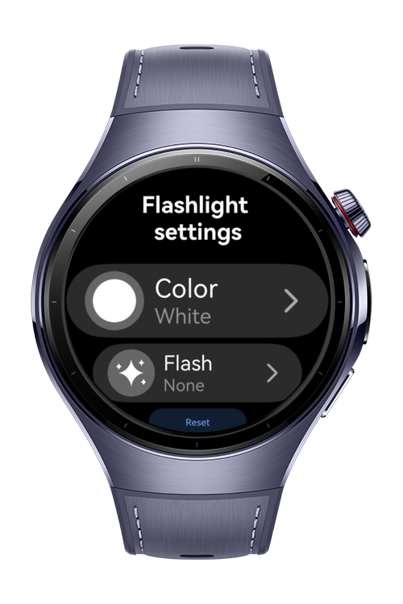
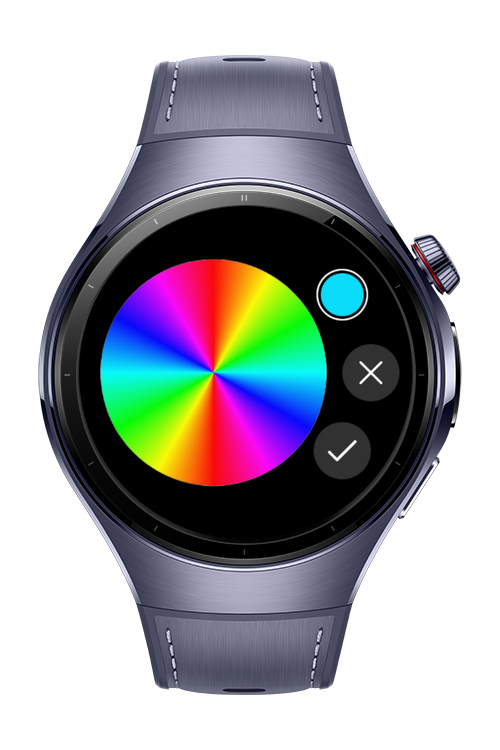
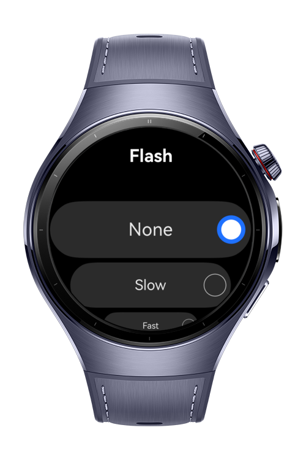

> **Note:** To access all shared projects, get information about environment setup, and view other guides, please visit [Explore-In-HMOS-Wearable Index](https://github.com/Explore-In-HMOS-Wearable/hmos-index).

# Flashlight

This app demonstrates a simple yet functional flashlight application, utilizing the device's screen as a light source with customizable colors and flashing patterns.

# Preview

<div>
  
  
  
  
</div>

# Use Cases

- **Turn On/Off Flashlight:** Activate or deactivate the screen-based flashlight with a single tap.
- **Color Picker:** Choose from a predefined set of colors for the screen light.
- **Custom Color Selection:** Select any desired color using a comprehensive color palette.
- **Flash Settings:** Adjust the flashing frequency between "Slow" and "Fast" modes.

# Tech Stack

- **Languages**: ArkTS, ArkUI, TypeScript
- **Frameworks**: HarmonyOS SDK 5.1.0(18)
- **Tools**: DevEco Studio Version 5.1.1.823
- **Libraries**:
    - `@kit.ArkUI`
    - `@kit.ImageKit`
    - `@kit.PerformanceAnalysisKit`
    - `@kit.AbilityKit`

# Directory Structure

```
entry/src/main/ets/
   └───common
   │   └───Logger.ets
   └───components
   │   └───SettingButton.ets
   └───entryability
   │   └───EntryAbility.ets
   └───entrybackupability
   │   └───EntryBackupAbility.ets
   └───model
   │   └───BlinkSpeed.ets
   │   └───ColorType.ets
   └───pages
   │   └───ColorOptions.ets
   │   └───CustomColorPicker.ets
   │   └───Flash.ets
   │   └───Flashlight.ets
   │   └───FlashlightSetting.ets
   │   └───Index.ets
   │   └───Main.ets
   │   └───Reset.ets
```

# Constraints and Restrictions

## Supported Device

* Huawei Watch 5

# License

**Flashlight** is distributed under the terms of the MIT License
See the [LICENSE](./LICENSE) for more information.